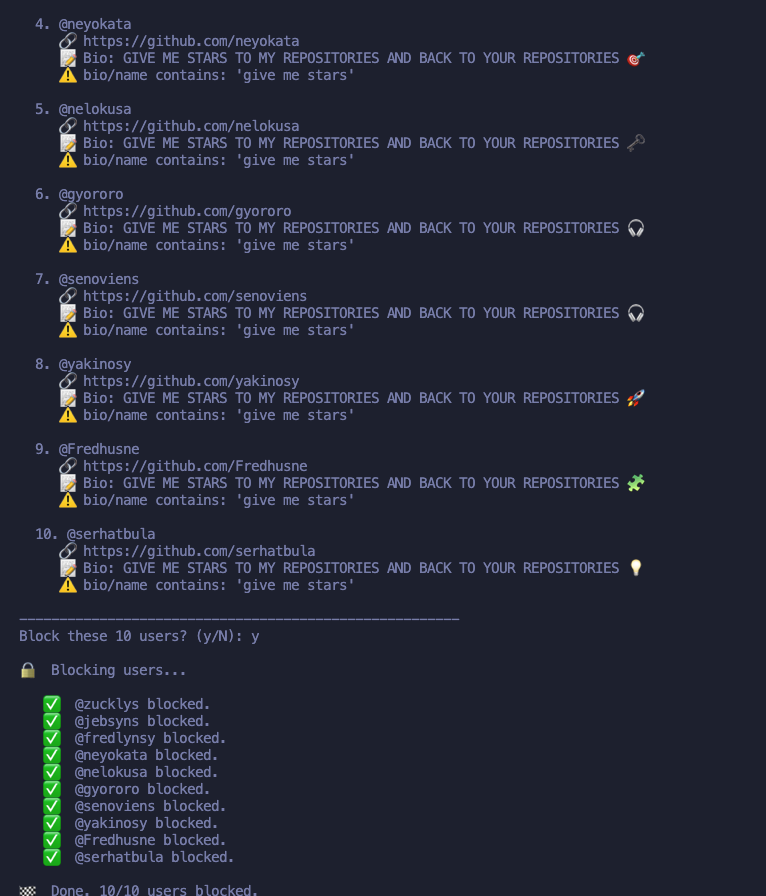

# 🧹 GitHub Follower Cleaner

A Python tool to automatically identify and remove suspicious followers or bots from your GitHub account.

---

## 📸 Example of detected bots



---

## ✅ Requirements

- Python 3.x
- `requests` library

---

## 📦 Installation

**1. Clone the repository:**
```bash
git clone https://github.com/your-username/github_follower_cleaner.git
cd github_follower_cleaner
```

**2. Install the required library:**
```bash
pip install requests
```

---

## 🔑 Setting up your GitHub Token

This script requires a **Personal Access Token (Classic)** from GitHub with permissions to read and manage your followers list.

### Where to get it?

1. Go to [GitHub](https://github.com) and sign in
2. Click on your profile picture → **Settings**
3. In the left menu, scroll down to **Developer settings**
4. Select **Personal access tokens** → **Tokens (classic)**
5. Click **Generate new token (classic)**
6. Give it a descriptive name, for example: `github-cleaner`
7. Select the following permissions (scopes):
   - ✅ `read:user`
   - ✅ `user:follow`
8. Click **Generate token**
9. **Copy the token immediately** — GitHub will not show it to you again

> ⚠️ **Important:** Copy the token directly from GitHub and paste it into the terminal without extra spaces or characters. Avoid copying it from text editors like LibreOffice, as they may add invisible characters that will invalidate the token.

---

## ▶️ How to run the script

**1. Load your token as an environment variable in the terminal:**

```bash
export GITHUB_TOKEN="your_token_here"
```

**2. Run the script:**

```bash
python3 github_follower_cleaner.py
```

The script will analyze your followers list and identify suspicious accounts based on criteria such as:
- No profile picture
- No public repositories
- No biography
- Unusual following/followers ratio
- No recent activity

---

## 🛡️ Why clean your followers?

- Bots inflate your metrics but bring no real value
- Some fake accounts are used for scraping your network
- A clean network improves the quality of your GitHub connections

---

## 📄 License

MIT — free to use, modify and share.

---

Made with 🐍 Python by [mlestrella843](https://github.com/mlestrella843)